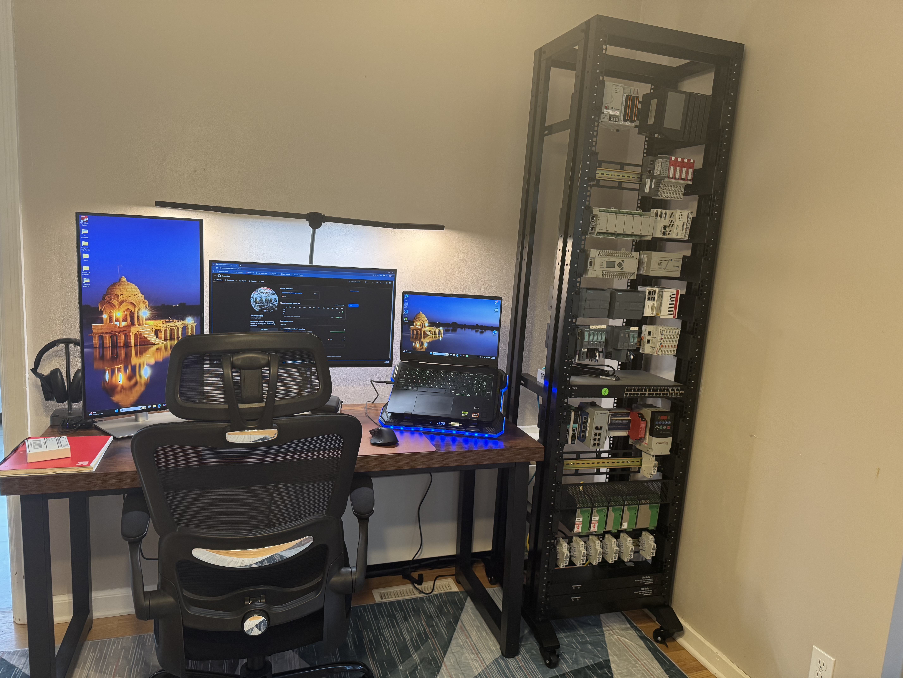
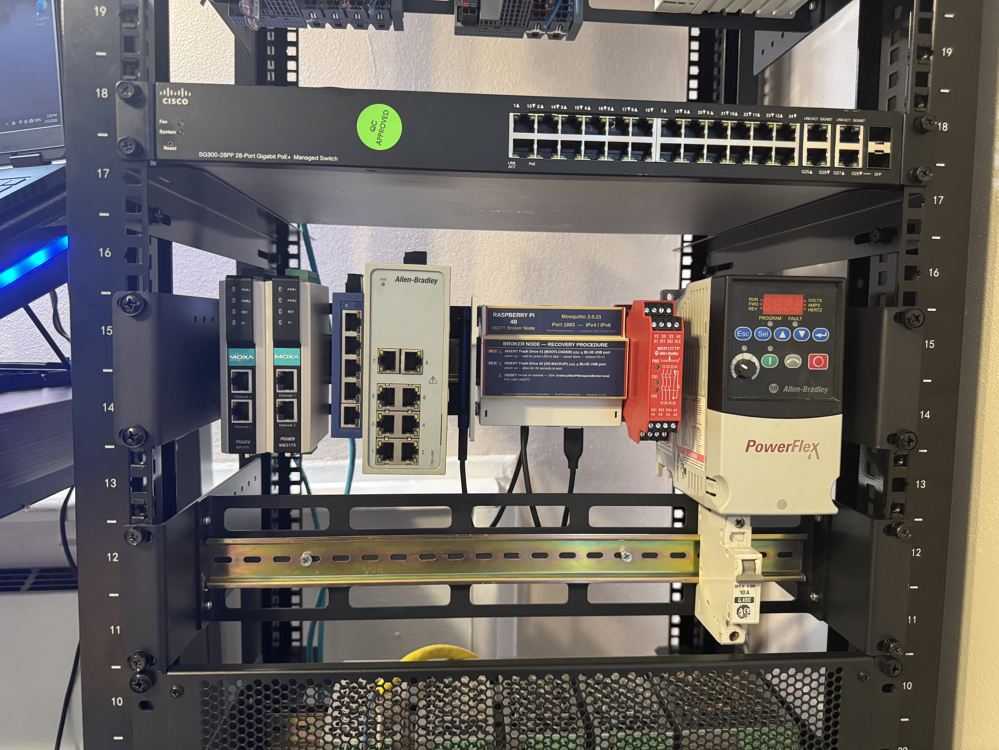

# Loogootee Manufacturing, Inc. — Training Rack Simulation

**42U Multi-Platform Automation and IIoT Integration Training Platform**

---

## Overview

A purpose-built industrial automation training platform simulating a two-site precision metal stamping operation. The project covers multi-vendor PLC programming, IIoT architecture, data infrastructure, and predictive maintenance — running 11 controllers across 5 vendors, 13 communication protocols, and a complete five-layer IIoT data stack.

The simulation company is named Loogootee Manufacturing, Inc. — a fictional precision metal stamping operation with facilities in Loogootee, Illinois (Site 1) and a remote packaging site (Site 2).

---

## Project Status

> 📋 This is an active build project. For current project state, open document revisions, pending architectural decisions, hardware status, action items, and phase gate criteria see the living project document:
>
> **[Project Status and Open Revisions](project_management/loogootee_mfg_project_status_and_open_revisions.docx)**

---

## Platform Summary

| | |
|---|---|
| **Controllers** | 11 across 5 vendors |
| **Vendors** | Allen-Bradley · Siemens · Beckhoff · Opto22 · Wago |
| **Protocols** | 13 — EtherNet/IP · PROFINET · PROFIBUS · EtherCAT · OPC-UA · Modbus TCP/RTU · DF1 · DH-485 · CIP Safety · S7 PUT/GET · Sparkplug B · MQTT · IO-Link |
| **IIoT Stack** | Mosquitto · Node-RED · Ignition · Telegraf · InfluxDB · Grafana |
| **Data Standard** | Sparkplug B · ISA-95 tag naming · Unified Namespace |
| **Rack** | 42U open frame · wheeled |
| **Simulation** | Two-site precision metal stamping — Loogootee Mfg., Inc. |

## Rack Photos

<p align="center">
  
  
</p>

---

## Controllers

### Site 1 — Loogootee, Illinois

| Controller | Platform | Simulation Role | Protocol |
|---|---|---|---|
| MicroLogix 1400 | Allen-Bradley | Stamping Press #2 | EtherNet/IP via MGate |
| MicroLogix 1000 | Allen-Bradley | Stamping Press #1 | DF1 via MGate EIP3170 |
| Micro850 | Allen-Bradley | Palletizer | EtherNet/IP |
| CompactLogix L24ER | Allen-Bradley | Wash Process | EtherNet/IP |
| GuardLogix + Point I/O | Allen-Bradley | Wash Safety | EtherNet/IP |
| S7-1200 #1 + ET200SP | Siemens | Inspection | PROFINET / S7 PUT/GET |
| S7-1200 #2 + ET200SP | Siemens | Conveyor | PROFINET / PROFIBUS / S7 PUT/GET |
| Beckhoff CX5120 + EK1100 | Beckhoff | High Speed Forming | EtherCAT / OPC-UA |
| groov EPIC-PR1 | Opto22 | Line Supervisor / Edge Device | Native MQTT / Sparkplug B |

### Site 2 — Remote

| Controller | Platform | Simulation Role | Protocol |
|---|---|---|---|
| Wago PFC200 750-8206 | Wago | Packaging | Native MQTT / Sparkplug B |
| Raspberry Pi 4B | Raspberry Pi | MQTT Broker Node | Mosquitto 2.0.21 |

---

## IIoT Stack Architecture

Five-layer stack. Each layer has a single non-overlapping responsibility.

```
OT Layer        →  11 PLC controllers — native protocols
Transport       →  EPIC Node-RED · Wago · Mosquitto broker · Node-RED
Intelligence    →  Ignition SCADA — single calculation engine — UNS intelligence
Historian       →  Telegraf → InfluxDB OSS — single source of historical truth
Visualization   →  Grafana OSS — read only — queries InfluxDB only
```

**Three governing principles:**
- One broker — Mosquitto is the real-time transport spine. Current state only. No processing.
- One calculation engine — Ignition calculates all derived metrics once and publishes back to broker. No consumer calculates independently.
- One historian — Telegraf captures everything that touches the broker into InfluxDB. Grafana reads InfluxDB only.

Infrastructure runs on an AOOSTAR WTR Max (Ryzen 7 PRO 8845HS · 32GB DDR5) running Proxmox VE with LXC containers for each stack component.

---

## Phased Development Plan

| Gate | Phase | Status |
|---|---|---|
| G0 | Project Initiation and Architecture Definition | Complete |
| G1 | Controller Commissioning and UNS Integration | In Progress |
| G2 | IIoT Stack Deployment and Network Security | Planned |
| G3 | Production Visibility and Historian | Planned |
| G4 | Physical System Expansion and UNS Extensibility | Planned |
| G5 | IO-Link Smart Sensors and Process Integration | Planned |
| G6 | Predictive Maintenance and Remote Demonstration | Planned |
| G7 | Independence Validation and Project Closeout | Planned |

The project is executed under a phase-gated discipline. Each phase has defined entry criteria that must be satisfied before the next phase is authorized to begin. Full gate criteria are documented in the [living project document](project_management/loogootee_mfg_project_status_and_open_revisions.docx).

---

## Repository Structure

```
loogootee-mfg-training-simulation/
│
├── project_management/
│   └── project_management_tools/
│
├── 00_company_profile/
│
├── 01_project_scope/
│
├── 02_standards/
│
├── 03_architecture/
│   ├── iiot_architecture/
│   ├── maintainx_architecture/
│   ├── network_architecture/
│   ├── uns_architecture/
│   └── wms_lot_traceability_architecture/
│
├── 04_program_specifications/
│   ├── plc_micro850/
│   └── plc_micrologix1000/
│
├── 05_IIoT_configuration/
│   ├── grafana/
│   ├── ignition/
│   ├── influxdb/
│   ├── mqtt_mosquitto_broker/
│   └── node-red_flows/
│
├── 06_rack_documentation/
│   ├── rack_documentation_package/
│   ├── rack_operations_manual/
│   ├── rack_phased_development_plan/
│   └── rack_photos/
│
├── 07_preface/
│
├── 08_io_link_implementation/
│   ├── ifm_al1590_vendor_docs_programming/
│   └── io_link_pump_module_concept/
│
├── 09_maintainx_implementation/
│
├── 10_nas_implementation/
│
└── README.md
```

---

## Learning Objectives

This project covers the following areas across its eight phases:

- Multi-vendor PLC programming — Allen-Bradley, Siemens, Beckhoff, Opto22, Wago
- Industrial communication protocols — EtherNet/IP, PROFINET, PROFIBUS, EtherCAT, OPC-UA, Modbus, DF1
- IIoT architecture — Unified Namespace, Sparkplug B, ISA-95 tag naming
- Data infrastructure — MQTT broker, time series historian, dashboards
- Edge computing — Node-RED protocol bridging, data contextualization
- IO-Link smart sensors — device integration, process monitoring
- Predictive maintenance — vibration baseline, threshold detection, automated work orders
- Remote access — Tailscale VPN mesh, secure tunnel, multi-site demonstration
- System extensibility — adding new equipment to a live UNS without reconfiguration
- Independence validation — documentation-driven independent system extension

---

*Loogootee Manufacturing, Inc. is a fictional company created for training and demonstration purposes.*
